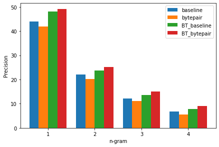
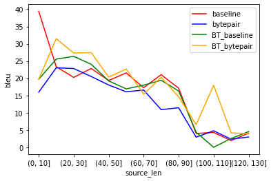
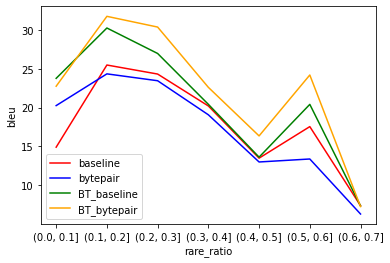

\vspace{-1.5cm}

# Introduction

We decided on experimenting with byte-pair encoding (Sennrich et al. 2015a) and with data augmentation via backtranslation (Sennrich et al. 2015b). Because the two variables are independent from one another, we ended up with four models that were evaluated against each other:

|                     | No Backtranslation | Backtranslation |
|---------------------|--------------------|-----------------|
| Moses tokenization  | `baseline`         | `BT_baseline`   |
| BPE tokenization    | `bytepair`         | `BT_bytepair`   |

For the models without backtranslation, we used the data provided in the repository.

## Model `baseline`

This is the model which was already trained in the original repository.

## Model `bytepair`

The first model uses byte-pair encoding to tokenize the parallel data (joint source and target). We hoped to capture additional morphological information, which would help with unknown words and therefore improve the baseline model.

Hyperparameters:
- 4000 vocabulary items for BPE (same as in the MT model)
- BPE trained jointly using source and target data

The hyperparameters of the MT model were the same as in the `baseline` model.

## Model `BT_baseline`

To train this model, we first trained a model to backtranslate English into French, using the same parallel training data as in the `baseline` and `bytepair` models. Since we noticed that our additional monolingual English data contained a lot of out-of-vocab words, we decided to use BPE for the backtranslation model (same configuration as in the `bytepair` model).

As our monolingual data, we took a random sample of 10000 sentences from the raw, untokenized English OpenSubtitles.org corpus (provided by [Opus](https://opus.nlpl.eu/OpenSubtitles.php)). We chose this corpus because it seems to be similar to the parallel data in terms of linguistic style. We filtered\footnote{see \href{https://github.com/pleyad/atmt/blob/master/data/en/filter.py}{script}} the monolingual data to eliminate some of the more drastic differences to the authentic data, specifically filtering out very short sentences, sentences with text encoding artifacts, and sentences containing brackets (as these are mostly narrations and not speech), and removing the dashes at the beginnings of sentences (marking turn taking between different speakers). After translating this corpus into French, we detokenized and postprocessed the data and added it to the original parallel data. This way, we ended up with a new training set of 20000 sentence pairs consisting of 50% authentic data and 50% back-translated data for training the final `BT_baseline` model.

We trained the forward-translation model without BPE and using the same hyperparameters as the `baseline` model.

## Model `BT_bytepair`

This model used the same mixed authentic-synthetic training corpus as in `BT_baseline`, but applied BPE (with the same configuration as in the `bytepair` model, trained on the entire training corpus) before training the final forward-translation model (with the same hyperparameters as in all other models).

## Links to scripts, model checkpoints, and translations

- [`baseline` model](https://github.com/pleyad/atmt/tree/master/assignments/03/baseline), [test set translations](https://github.com/pleyad/atmt/blob/master/assignments/03/baseline/translations.p.txt)
- [`bytepair` model](https://github.com/pleyad/atmt/tree/master/assignments/03/spm_vanilla), [test set translations](https://github.com/pleyad/atmt/blob/master/assignments/03/spm_vanilla/translations/postprocessed_spm_vanilla_fully_trained.txt)
- [Backtranslation model for `BT_baseline` and `BT_bytepair`](https://github.com/pleyad/atmt/tree/master/assignments/03/backtranslation/en2fr), [test set translations](https://github.com/pleyad/atmt/blob/master/assignments/03/backtranslation/en2fr/data/translated/postprocessed_mono.fr)
- [`BT_baseline` model](https://github.com/pleyad/atmt/tree/master/assignments/03/backtranslation/doubledata_baseline), [test set translations](https://github.com/pleyad/atmt/blob/master/assignments/03/backtranslation/doubledata_baseline/translations.txt)
- [`BT_bytepair` model](https://github.com/pleyad/atmt/tree/master/assignments/03/backtranslation/doubledata_spm), [test set translations](https://github.com/pleyad/atmt/blob/master/assignments/03/backtranslation/doubledata_spm/translations.txt)

Whenever no specific pre-/postprocessing script is present in the folder, the baseline preprocessing script of the baseline was used.

# Results

We translated and postprocessed the test set with each model and used *sacrebleu* for evaluation.

{width=8cm}

{width=8cm}
{width=8cm}

# Discussion

We noticed that the test set does not contain any unknown words, and therefore there is less reason to apply a subword encoding. This may be an explanation why the `bytepair` model did not perform better than the `baseline`. In the case of the `BT` models, where a larger variety of words is introduced due to the additional data, subword encoding does improve performance.

# Reflection

We learned that backtranslation seems to be a very simple yet reliable way to increase translation performance in low-resource scenarios. We were happy to see that our choices of data and preprocessing worked well with this method. We also learned (the hard way) that it is very difficult (but important) to keep the scripts, data, and model files neatly organized to avoid errors and confusion.

Since we did not experiment with or optimize hyperparameters, it is possible that there are still more performance boosts lurking inside the models. In another experiment, we would try to experiment with the vocabulary size in particular, since this seemed to be somewhat of a bottleneck especially for the models without BPE.

# References

- Sennrich, R., Haddow, B., & Birch, A. (2015a). Neural machine translation of rare words with subword units. arXiv preprint arXiv:1508.07909.
- Sennrich, R., Haddow, B., & Birch, A. (2015b). Improving neural machine translation models with monolingual data. arXiv preprint arXiv:1511.06709.
