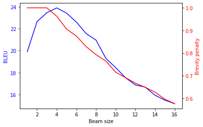
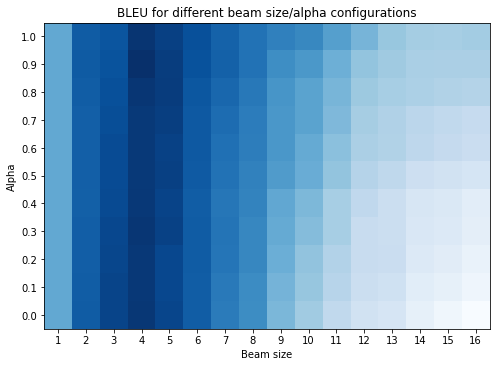

Link to GitHub repo: [https://github.com/pleyad/atmt](https://github.com/pleyad/atmt) (relevant files are [`translate_beam.py`](https://github.com/pleyad/atmt/blob/master/translate_beam.py) and [`assignments/04/**/*`](https://github.com/pleyad/atmt/tree/master/assignments/04))

# Experimenting with Beam Search

<!-- Visualize Bleu-Scores in an appropriate plot --->
<!-- One or two paragraphs of analysis --->
<!-- - What happens to the brevity penalty with increasing beam size--->
<!-- - Plot with BLEU (y) and brevity penalty (x) --->
<!-- - Effect of larger beam size at decoding time --->

{width=8cm}

We translated the test data with beam size $k$ ranging from 1 to 16. In Figure 1, both the BLEU score and the brevity penalty are plotted against the beam size. The brevity penalty continously decreases (i.e. scores are more strongly penalized) with increasing beam size, which leads to the conclusion that with a larger beam size, the model tends towards shorter sentences. The BLEU score starts low, reaches its maximum at the beam size of 4 but then quickly decreases again.

Because the BLEU score is directly tied to the brevity penalty (n-gram precision * brevity penalty), we would expect them to be correlate quite strongly.
However, we see that for the first few beam sizes BLEU starts increasing, even though at $k=4$ the brevity penalty already starts penalizing.
Up until $k=4$, the trade-off between sentence shortness and n-gram precision seems to work in favour of the final score, where afterwards the brevity penalty simple punishes too much for BLEU to be in a competitive range. 

# Understanding the Code

1. **What is "go_slice" used for and what do its dimensions represent?** `go_slice` is two-dimensional tensor with the first dimension representing the batch size and the second dimension simply being 1, representing the initializing token of the decoded sentence. It consists of eos-symbols and is used as the first decoder input. 

2. **Why do we keep one top candidate more than the beam size?** When a token in the candidates is unknown, the next most likely token is used instead. However, if the last token of the beam is unknown, we need a final fallback token. Therefore, an additional token is remembered.

3. **Why do we add the node with a negative score?** So that the least likely states of the beam will get a higher score in the queue. When the queue is emptied, the items with the lowest scores are returned first, i.e. the most likely nodes.

4. **How are "add" and "add_final" different? What would happen if we did not make this distinction?** `add_final()` adds the EOS node not to the `nodes`-queue, but to the `final`-queue (and pads them to maximum length). If they would be simply added to the `nodes`-queue (using `add()`), the model might still be trying to continue on them. Additionally, they might get pruned, but we want to keep the finished sentences. 
 
5. **What happens internally when we prune our beams? How do we know we always maintain the best sequences?** When we prune, we retrieve the $k$ best beam ends (nodes) with the highest likelihood (except for finished sentences). Finished sentences are stored, and all other nodes are discarded. This is facilated by using the `PriorityQueue` class, that uses the log-likelihood of the nodes as the priority metric.

6. **What is the purpose of this for loop?** 
This for loop strips away the padding, or more precisely, strips away everything from the first eos-symbol on, which in most cases should only be padding.

# Adding Length Normalization

We searched the space with $\alpha = [0, 1], k = [1, 16]$ for the optimal combination of length normalization and beam size. The following heatmap shows the BLEU score for the tested hyperparameter space.

{width=10cm}

The optimal configuration turns out to be $\alpha = 0.9, k = 4$, with a BLEU score of 24.17. As the heatmap shows, BLEU is much more sensitive to beam size than to length normalization.

<!-- Find the optimal α value for the best beam size k from exercise 1 -->
<!-- Redo exercise 1, but this time with the new α. Does the best beam size k change? --->
<!-- - Visualizing BLEU-scores in an appropriate plot --->
<!-- - Discussion of the BLEU-scores --->
 

# Investigate the Diversity of Beam Search

<!-- With the best parameters (k,α) and normal beam search get n-best translation --->
<!-- With the best parameters (k,α) and diverse beam search get n-best translation --->

<!-- Compare the resulting translations --->
<!-- Experiment with different \gamma values (⚠⚠ Log Probabilities!) --->

<!-- Discuss findings --->
<!-- - Show examples --->
<!-- - Briefly explain diverse beam search implementation (could be done first) --->

Our implementation modifies the log probabilities output by the decoder at each timestep by subtracting a [penalty vector](https://github.com/pleyad/atmt/blob/1448cc9820cc241b5829a61e547ade49b862ee59/translate_beam.py#L164) according to the procedure described by Li and Jurafsky (2016).

From our observations, diverse beam search seems to encourage diverging branches earlier, i.e. the first differences between n-best translations appear earlier in the sentence ($\gamma = 0$ means disabling diverse beam search):

| | |
| --- | --- |
| Source | L'armée de Napoléon a marché jusqu'à Moscou. |
| Reference | Napoleon's army has advanced to Moscow. |
| | |
| $\gamma = 0$ | The church of Navala has been in Mr. Kosh. |
|       | The church of Navala has been in Mr. Moscy |
|       | The church of Navala has been in Mr. Mosh. |
|       | The church of Navala has been in Mr. Dosca |
| | |
| $\gamma = 1$ | The stage of Navala has been until Moscy. |
|       | The stage of Navala has been until Moshy. |
|       | The stage of Naval Mosca has been until Moscy. |
|       | The stage of Naval Mosca has been until Moshy. |

Indeed, in the following example, increasing $\gamma$ seems to incentivize the algorithm to perform more and earlier splits during beam search, and to produce more diverse translations for out-of-vocabulary words (such as *l'ampoule*).

\pagebreak

| | |
| --- | --- |
| Source | Tom a dévissé l'ampoule. |
| Reference | Tom unscrewed the light bulb. |
| | |
| $\gamma = 0$ | Tom deeped him. |
| | Tom deeped the wood. |
| | Tom deeped the woods. |
| | Tom deeped him to have the wood. |
| | |
| $\gamma = 1$ | Tom deeped him. |
| | Tom has made the bank. |
| | Tom deeped the wood. |
| | Tom deeped the wound. |
| | |
| $\gamma = 2$ | Tom deeped him. |
| | Tom has made the bank. |
| | Tom deeped the wood. |
| | Tom has made the woods. |

However, most of the time, different values of $\gamma$ do not seem to make a large difference in the output, sometimes only reordering the hypotheses:

| | |
| --- | --- |
| Source | Tom a promis de ne plus jamais refaire ça. |
| Reference | Tom promised never to do that again. |
| | |
| $\gamma = 0$ | Tom promised to never do that. |
| | Tom promised to never do that anymore. |
| | Tom promised to never do that again. |
| | Tom promised to never do that again that's not to do that. |
| | |
| $\gamma = 1$ | Tom promised to never do that anymore. |
| | Tom promised to never do that again. |
| | Tom promised to never do that. |
| | Tom promised to never do that again that's not to do that. |
| | |
| $\gamma = 2$ | Tom promised to never do that anymore. |
| | Tom promised to never do that again. |
| | Tom promised to never do that again that. |
| | Tom promised to never do that again that's not to do that. |

Our hypothesis is that diverse beam search mainly has an effect on hypothesis selection when the scores of the different hypotheses are very close to each other (for example in the case of out-of-vocabulary words, where the model has trouble deciding on a single best translation). We also expected the effect to be stronger in all cases when we set the parameter $\gamma$ to very large values (e.g. 1000), but this does not seem to be the case. The effect does not seem to become more extreme at some point. We are unsure about how to interpret these observations.
